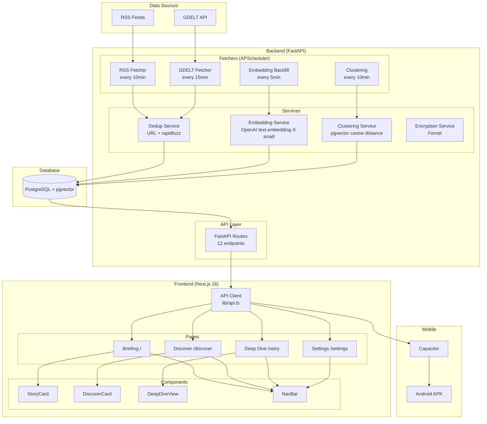
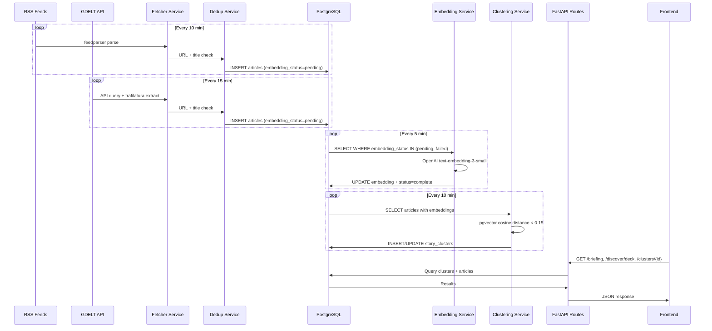
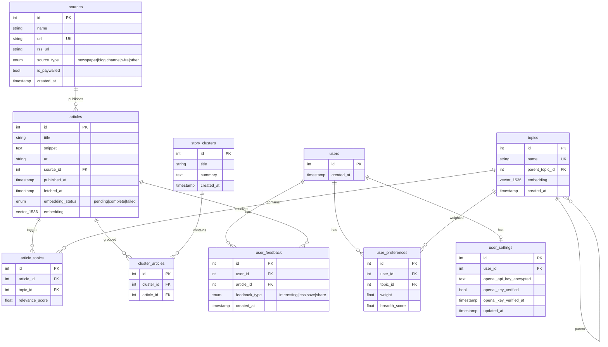
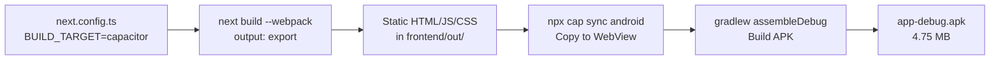

# Architecture — NewsLens

## System Overview

NewsLens is a two-language AI news intelligence platform: Python backend (data pipeline + ML) and TypeScript frontend (UI), communicating via REST JSON. Mobile builds use Capacitor to wrap the frontend into a native Android WebView.

## System Diagram

## Data Pipeline Flow

## Database Schema

**pgvector columns:** `articles.embedding` and `topics.embedding` are `Vector(1536)` for OpenAI text-embedding-3-small. Clustering uses cosine distance with threshold 0.15.

## Capacitor Build Pipeline

Web builds use `rewrites()` to proxy `/api/*` to the backend. Capacitor builds use `NEXT_PUBLIC_API_BASE_URL` env var to point directly to the backend host.

## Decision Log

| Decision | Chosen | Alternative | Rationale |
|----------|--------|-------------|-----------|
| Clustering | pgvector cosine distance SQL | Python pairwise comparison | O(n) vs O(n²); DB-native; no data transfer overhead |
| Scheduler | APScheduler in-process | Celery + Redis | Simpler for single-process MVP; no extra infrastructure |
| Title dedup | rapidfuzz | python-Levenshtein | 10-100x faster; pure C implementation; better API |
| DB driver | asyncpg | psycopg2 | Preserves FastAPI's async benefits; native async protocol |
| Frontend framework | Next.js App Router | Vite + React Router | SSR capability; file-based routing; built-in optimizations |
| Mobile | Capacitor static export | React Native rewrite | Zero code duplication; wraps existing web app; 4.75 MB APK |
| API proxy | Next.js rewrites | CORS headers | No CORS configuration needed; single origin in dev |
| Encryption | Fernet (symmetric) | RSA / AES-GCM | Simple, battle-tested; good for per-user key storage |
| CSS | Tailwind CSS 4 | CSS Modules / styled-components | Utility-first; design token integration; small bundle |
| Motion | Framer Motion | CSS animations | Complex gesture physics (swipe cards); declarative API |
