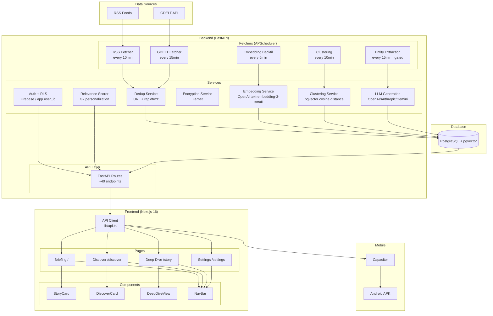
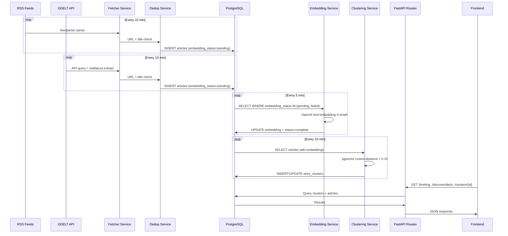
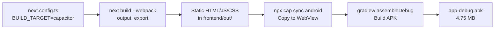

# Architecture — NewsLens

## System Overview

NewsLens is a two-language AI news intelligence platform: Python backend (data pipeline + ML) and TypeScript frontend (UI), communicating via REST JSON. Mobile builds use Capacitor to wrap the frontend into a native Android WebView.

Beyond the ingest→cluster→summarize core, the platform now layers on: **multi-provider LLM generation** (BYOM — OpenAI/Anthropic/Gemini, per-user key + model; embeddings stay OpenAI), **Firebase auth + Postgres RLS** for multi-user identity (single-user dev fallback), a **knowledge graph** (G1 global entity backbone + G2 per-user entity-relevance overlay), and **on-by-default personalization** that re-ranks the cast strip, feed, briefing, and search from one shared relevance scorer (a zero-signal user is a no-op). See the Decision Log for the rationale behind each.

## System Diagram

```mermaid
graph TB
    subgraph "Data Sources"
        RSS[RSS Feeds]
        GDELT[GDELT API]
    end

    subgraph "Backend (FastAPI)"
        subgraph "Fetchers (APScheduler)"
            RF[RSS Fetcher<br/>every 10min]
            GF[GDELT Fetcher<br/>every 15min]
            EB[Embedding Backfill<br/>every 5min]
            CL[Clustering<br/>every 10min]
            EE[Entity Extraction<br/>every 15min · gated]
        end

        subgraph "Services"
            DEDUP[Dedup Service<br/>URL + rapidfuzz]
            EMB[Embedding Service<br/>OpenAI text-embedding-3-small]
            CLUST[Clustering Service<br/>pgvector cosine distance]
            ENC[Encryption Service<br/>Fernet]
            LLM[LLM Generation<br/>OpenAI/Anthropic/Gemini]
            AUTH[Auth + RLS<br/>Firebase / app.user_id]
            REL[Relevance Scorer<br/>G2 personalization]
        end

        subgraph "API Layer"
            ROUTES[FastAPI Routes<br/>~40 endpoints]
        end
    end

    subgraph "Database"
        PG[(PostgreSQL + pgvector)]
    end

    subgraph "Frontend (Next.js 16)"
        subgraph "Pages"
            BRIEF[Briefing /]
            DISC[Discover /discover]
            DEEP[Deep Dive /story]
            SETT[Settings /settings]
        end

        subgraph "Components"
            SC[StoryCard]
            DC[DiscoverCard]
            DDV[DeepDiveView]
            NAV[NavBar]
        end

        API_CLIENT[API Client<br/>lib/api.ts]
    end

    subgraph "Mobile"
        CAP[Capacitor]
        APK[Android APK]
    end

    RSS --> RF
    GDELT --> GF
    RF --> DEDUP --> PG
    GF --> DEDUP
    EB --> EMB --> PG
    CL --> CLUST --> PG
    EE --> LLM --> PG
    AUTH --> ROUTES
    REL --> ROUTES
    PG --> ROUTES
    ROUTES --> API_CLIENT
    API_CLIENT --> BRIEF & DISC & DEEP & SETT
    BRIEF --> SC
    DISC --> DC
    DEEP --> DDV
    BRIEF & DISC & DEEP & SETT --> NAV
    API_CLIENT --> CAP --> APK
```

## Data Pipeline Flow

```mermaid
sequenceDiagram
    participant RSS as RSS Feeds
    participant GDELT as GDELT API
    participant Fetch as Fetcher Service
    participant Dedup as Dedup Service
    participant DB as PostgreSQL
    participant Embed as Embedding Service
    participant Cluster as Clustering Service
    participant API as FastAPI Routes
    participant UI as Frontend

    loop Every 10 min
        RSS->>Fetch: feedparser parse
        Fetch->>Dedup: URL + title check
        Dedup->>DB: INSERT articles (embedding_status=pending)
    end

    loop Every 15 min
        GDELT->>Fetch: API query + trafilatura extract
        Fetch->>Dedup: URL + title check
        Dedup->>DB: INSERT articles (embedding_status=pending)
    end

    loop Every 5 min
        DB->>Embed: SELECT WHERE embedding_status IN (pending, failed)
        Embed->>Embed: OpenAI text-embedding-3-small
        Embed->>DB: UPDATE embedding + status=complete
    end

    loop Every 10 min
        DB->>Cluster: SELECT articles with embeddings
        Cluster->>Cluster: pgvector cosine distance < 0.15
        Cluster->>DB: INSERT/UPDATE story_clusters
    end

    UI->>API: GET /briefing, /discover/deck, /clusters/{id}
    API->>DB: Query clusters + articles
    DB->>API: Results
    API->>UI: JSON response
```

> **Not shown:** a 5th, gated job (`GRAPH_EXTRACTION_ENABLED`) extracts entities from settled clusters via the provider-aware LLM into `entities` / `article_entities`. On reads, `get_current_user` sets the RLS GUC `app.user_id`, and the personalized surfaces (cast strip, feed, briefing, search) call the shared relevance scorer (`entities.score_clusters_relevance`) before responding.

## Database Schema

```mermaid
erDiagram
    users {
        int id PK
        timestamp created_at
    }

    sources {
        int id PK
        string name
        string url UK
        string rss_url
        enum source_type "newspaper|blog|channel|wire|other"
        bool is_paywalled
        timestamp created_at
    }

    articles {
        int id PK
        string title
        text snippet
        string url
        int source_id FK
        timestamp published_at
        timestamp fetched_at
        enum embedding_status "pending|complete|failed"
        vector_1536 embedding
    }

    topics {
        int id PK
        string name UK
        int parent_topic_id FK
        vector_1536 embedding
        timestamp created_at
    }

    article_topics {
        int id PK
        int article_id FK
        int topic_id FK
        float relevance_score
    }

    story_clusters {
        int id PK
        string title
        text summary
        timestamp created_at
    }

    cluster_articles {
        int id PK
        int cluster_id FK
        int article_id FK
    }

    user_feedback {
        int id PK
        int user_id FK
        int article_id FK
        enum feedback_type "interesting|less|save|share"
        timestamp created_at
    }

    user_preferences {
        int id PK
        int user_id FK
        int topic_id FK
        float weight
        float breadth_score
    }

    user_settings {
        int id PK
        int user_id FK
        text openai_api_key_encrypted
        bool openai_key_verified
        timestamp openai_key_verified_at
        text gemini_api_key_encrypted
        text anthropic_api_key_encrypted
        string active_provider "openai|anthropic|gemini"
        json model_prefs "per-provider model overrides"
        timestamp updated_at
    }

    follows {
        int id PK
        int user_id FK
        string kind "topic|entity|saved_search"
        string value
        int entity_id FK "G2: resolved entity (nullable)"
        timestamp created_at
    }

    cluster_edges {
        int id PK
        int src_cluster_id FK
        int dst_cluster_id FK
        string kind "successor|background|duplicate"
        float score
    }

    entities {
        int id PK
        string canonical_name
        string name_norm
        string kind "person|org|place|other"
    }

    entity_aliases {
        int id PK
        int entity_id FK
        string alias_norm
        string source
    }

    article_entities {
        int id PK
        int article_id FK
        int entity_id FK
        float salience
        float confidence
    }

    user_entity_relevance {
        int user_id PK
        int entity_id PK
        string source "follow|feedback"
        float engagement_raw
        timestamp last_event_at
        float score
    }

    users ||--o{ user_feedback : has
    users ||--o{ user_preferences : has
    users ||--o| user_settings : has
    sources ||--o{ articles : publishes
    articles ||--o{ article_topics : tagged
    topics ||--o{ article_topics : contains
    topics ||--o{ topics : parent
    articles ||--o{ cluster_articles : grouped
    story_clusters ||--o{ cluster_articles : contains
    articles ||--o{ user_feedback : receives
    topics ||--o{ user_preferences : weighted
    users ||--o{ follows : has
    users ||--o{ user_entity_relevance : has
    entities ||--o{ entity_aliases : aliased
    articles ||--o{ article_entities : mentions
    entities ||--o{ article_entities : mentioned_in
    entities ||--o{ user_entity_relevance : scored
    entities ||--o{ follows : followed
    story_clusters ||--o{ cluster_edges : links
```

**pgvector columns:** `articles.embedding` and `topics.embedding` are `Vector(1536)` for OpenAI text-embedding-3-small. Clustering uses cosine distance with threshold 0.15.

**Knowledge-graph tables (Wave D Phase 3):** `entities` / `entity_aliases` / `article_entities` are the global G1 backbone (populated by the gated extraction job). `user_entity_relevance` (composite PK `user_id,entity_id`) is the G2 per-user overlay that drives personalization; `follows.entity_id` links an entity-follow to its graph node. `cluster_edges` (Wave D2) is the directed temporal "how we got here" graph between clusters.

**Row-level security:** `user_feedback`, `user_preferences`, `user_settings`, `follows`, and `user_entity_relevance` carry RLS policies (enforce-when-set on the GUC `app.user_id`; permissive for background jobs). They enforce only under a non-superuser DB role — the explicit `current_user_id()` query filter is the primary control. See `backend/scripts/create_app_role.sql`.

**BYOM columns:** `user_settings` now stores per-provider encrypted keys (OpenAI/Gemini/Anthropic) plus `active_provider` and a `model_prefs` JSONB of per-provider model overrides.

## Capacitor Build Pipeline

```mermaid
flowchart LR
    A[next.config.ts<br/>BUILD_TARGET=capacitor] --> B[next build --webpack<br/>output: export]
    B --> C[Static HTML/JS/CSS<br/>in frontend/out/]
    C --> D[npx cap sync android<br/>Copy to WebView]
    D --> E[gradlew assembleDebug<br/>Build APK]
    E --> F[app-debug.apk<br/>4.75 MB]
```

Web builds use `rewrites()` to proxy `/api/*` to the backend. Capacitor builds use `NEXT_PUBLIC_API_BASE_URL` env var to point directly to the backend host.

**Brand assets & splash.** The launcher icon, web/PWA favicons, and the native splash all derive from the official NewsLens brand kit (the single source of truth). They're generated **deterministically** (PowerShell `System.Drawing` high-quality resize) rather than via `@capacitor/assets`/`sharp`, which fail to load on Windows ARM (the current `@capacitor/assets` also emits broken adaptive output). The native splash is held by `@capacitor/splash-screen` (`launchAutoHide: false`, `#0C0C0E`) and hidden with a ~250 ms fade from `frontend/src/components/SplashScreen.tsx` once the web app paints — a controlled native-splash → WebView hand-off with no bare-WebView flash.

## Decision Log

| Decision | Chosen | Alternative | Rationale |
|----------|--------|-------------|-----------|
| Clustering | pgvector cosine distance SQL | Python pairwise comparison | O(n) vs O(n²); DB-native; no data transfer overhead |
| Scheduler | APScheduler in-process | Celery + Redis | Simpler for single-process MVP; no extra infrastructure |
| Title dedup | rapidfuzz | python-Levenshtein | 10-100x faster; pure C implementation; better API |
| DB driver | asyncpg | psycopg2 | Preserves FastAPI's async benefits; native async protocol |
| Frontend framework | Next.js App Router | Vite + React Router | SSR capability; file-based routing; built-in optimizations |
| Mobile | Capacitor static export | React Native rewrite | Zero code duplication; wraps existing web app; 4.75 MB APK |
| API proxy | Next.js rewrites | CORS headers | No CORS configuration needed; single origin in dev |
| Encryption | Fernet (symmetric) | RSA / AES-GCM | Simple, battle-tested; good for per-user key storage |
| Auth | Firebase Admin SDK + Postgres RLS | Custom JWT / sessions | Offloads identity (Google + Email/Password); `app.user_id` GUC + RLS gives defense-in-depth; `AUTH_REQUIRED=false` keeps single-user dev |
| Per-user isolation | Explicit `current_user_id()` filter + RLS | RLS alone | RLS is inert under a superuser role, so the explicit filter is the primary control; RLS (non-superuser role) is defense-in-depth |
| LLM generation | Multi-provider (OpenAI/Anthropic/Gemini), per-user key + model | OpenAI-only | BYOM avoids lock-in + cost sensitivity; per-user `active_provider` + `model_prefs`; embeddings stay OpenAI for vector consistency |
| Entity graph | Exact + alias resolution on normalized columns (G1); per-user relevance overlay (G2) | Embedding NN dedup / auto-merge | Precision-biased + cheap at MVP scale; embedding-NN merge deferred until it's justified by data |
| Personalization | One shared `AVG(decayed)` cluster scorer across all surfaces, on by default | Per-surface bespoke ranking / off by default | DRY + consistent; salience omitted so a zero-signal user is a guaranteed no-op (safe to default on) |
| Decay | Read-time half-life (`exp(-ln2·age/hl)`, age clamped ≥0) | Cron/materialized scores | No background job; always-fresh; clock-skew-safe |
| CSS | Tailwind CSS 4 | CSS Modules / styled-components | Utility-first; design token integration; small bundle |
| Motion | Framer Motion | CSS animations | Complex gesture physics (swipe cards); declarative API |
| Brand assets | Single source of truth (official NewsLens brand kit) | Ad-hoc per-surface art | One canonical mark/lockup; icons + splash regenerate from it, no drift |
| Icon/splash generation | Deterministic `System.Drawing` resize | `@capacitor/assets` / `sharp` | sharp won't load on Windows ARM; current `@capacitor/assets` emits broken adaptive output (dangling background ref, undersized foregrounds) |
| Splash control | `@capacitor/splash-screen` controlled fade | Default launch auto-hide | Holds the native splash until the WebView paints, then cross-fades — no white flash or hard cut |
